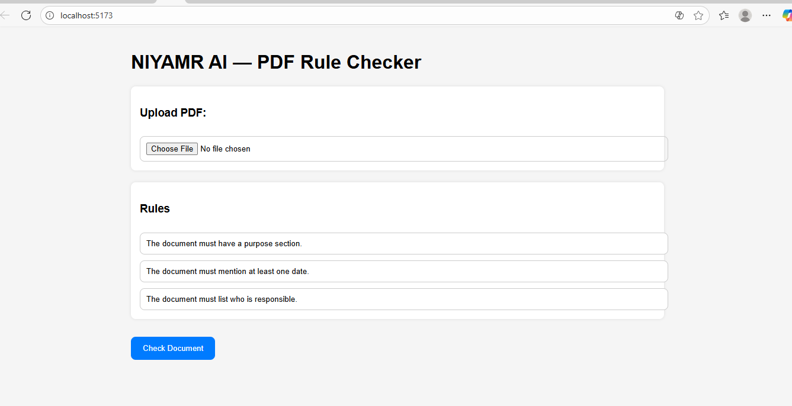

# 🧠 NIYAMR AI — PDF Rule Checker

A simple and fully working full-stack application that allows a user to:

✔ Upload a PDF  
✔ Enter 3 custom rules  
✔ Automatically check the PDF using heuristics  
✔ Receive PASS/FAIL results with evidence, reasoning, and confidence  

This project meets all requirements of the assignment and works end-to-end.

---

## 📸 Screenshots of Working Application

### 🖼 Screenshot 1 — Main UI  


### 🖼 Screenshot 2 — Results Page  


---

## 🚀 Features

### **Frontend (React + Vite)**
- PDF uploader  
- Three rule input fields  
- Clean and modern UI  
- Card-based layout  
- PASS/FAIL badges  
- Detailed results table  
- Loading state  
- Fully responsive  

### **Backend (FastAPI)**
- PDF text extraction using **pdfplumber**  
- Heuristic rule checking (works even without OpenAI API key)  
- CORS enabled  
- Clear JSON response format  
- Well-structured code  

---

## 📂 Project Folder Structure

```
niyamr-ai-48h/
│
├── backend/
│   ├── main.py
│   ├── requirements.txt
│   └── (FastAPI backend)
│
├── frontend/
│   ├── src/
│   │   ├── App.jsx
│   │   ├── main.jsx
│   │   ├── api.js
│   │   └── styles.css
│   └── (React frontend)
│
├── .env
└── README.md
```

---

## ⚙️ Backend Setup (FastAPI)

```bash
cd backend
pip install -r requirements.txt
uvicorn main:app --reload --port 8000
```

Backend available at:  
👉 http://127.0.0.1:8000/docs

---

## 💻 Frontend Setup (React + Vite)

```bash
cd frontend
npm install
npm run dev
```

Frontend available at:  
👉 http://localhost:5173/

---

## 🧪 Example API Response

```json
{
  "rule": "The document must mention a date.",
  "status": "pass",
  "evidence": "Found text: '2024'",
  "reasoning": "Heuristic match for year/date.",
  "confidence": 88
}
```

---

